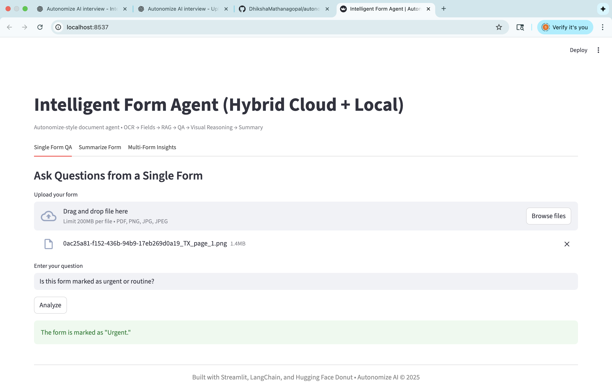
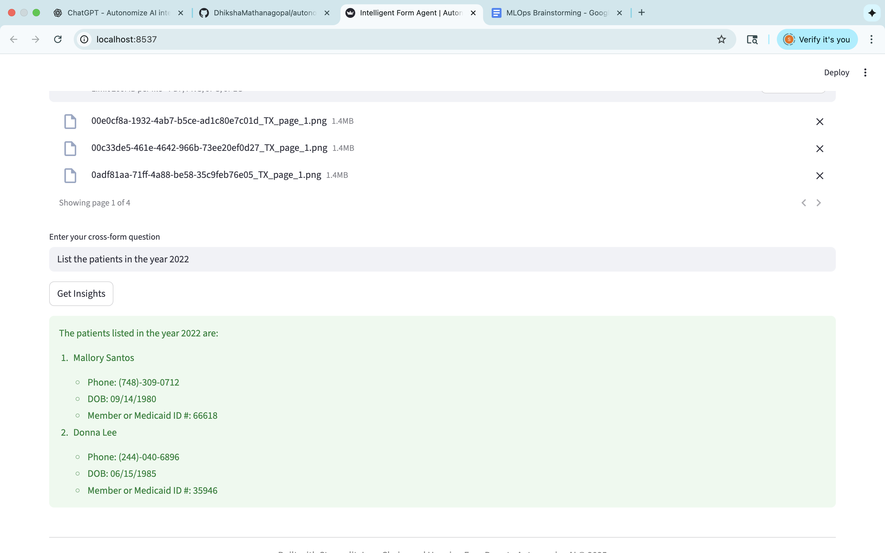
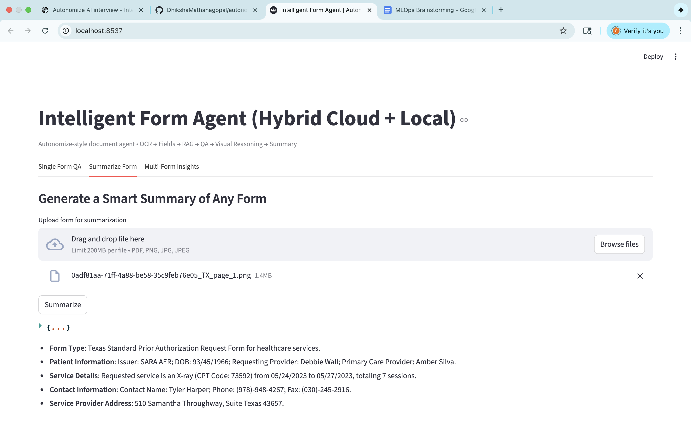

# 🧠 Intelligent Form Agent – Machine Learning Project

The **Intelligent Form Agent** is an AI-driven system designed to automatically read, extract, and summarize structured and unstructured information from complex documents such as healthcare or insurance forms.  
It leverages **OCR, NLP, and Retrieval-Augmented Generation (RAG)** to provide accurate answers, multi-document insights, and concise summaries without requiring manual review.

---

## ⚙️ Setup Instructions

### 1️⃣ Clone the Repository
```bash
git clone https://github.com/DhikshaMathanagopal/autonomize-intelligent-form-agent.git
cd autonomize-intelligent-form-agent
```

### 2️⃣ Create Virtual Environment & Install Dependencies
```bash
python3 -m venv .venv
source .venv/bin/activate
pip install -r requirements.txt
```

### 3️⃣ Run the Streamlit App
```bash
streamlit run src/app.py
```

---

## 💡 Example Prompts

### 🩺 Single-Form QA
Ask detailed questions about a single uploaded form:
- Who is the patient?  
- What is the diagnosis?  
- When was the form submitted?  
- Who is the provider?  
- Is this a new or renewal request?  
- What therapy is requested?

### 📊 Multi-Form Insights
Ask questions across multiple forms to get aggregated insights:
- How many unique patients appear across these forms?  
- Which providers appear in more than one document?  

### 📝 Summarization
Ask for a holistic summary:
> “Summarize this form focusing on: patient, provider, diagnosis, request type, and any required actions.”

---

## 📸 Manual Screenshots

Below are screenshots demonstrating the Intelligent Form Agent in action.  
*(These were manually captured, not Streamlit auto-saves.)*

| Description | Screenshot |
|--------------|-------------|
| **Single-Form QA Response** |  |
| **Multi-Form Insight Example** |  |
| **Summarization Output** |  |

---

## 🧩 Folder Structure

```
autonomize-intelligent-form-agent/
│
├── src/                     # Main application code (agent logic, OCR, embeddings)
├── tests/                   # Unit and integration tests
├── docs/
│   └── screenshots/         # Manual screenshots for documentation
├── requirements.txt         # Python dependencies
├── README.md                # Project documentation
└── .gitignore
```

---

## 💡 Creativity Extensions

- Integration of **multi-model OCR** (EasyOCR, Tesseract, LayoutLMv3)
- LLM-based quality evaluation of extracted text
- Adaptive RAG pipeline for contextual QA and summarization
- Optional Streamlit interface for interactive form understanding

---

## 🏁 Author
**Dhiksha Mathanagopal**  
📍 Northeastern University | Intelligent Systems & MLOps Coursework Project

---
